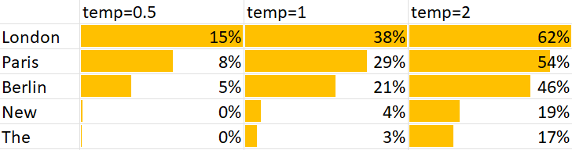

# Visualizing LLM hallucinations

<!-- markdownlint-disable no-space-in-code -->

Large language models generate tokens (chunks of text) one at a time. Given text, it:

1. Guesses possible next tokens (from training)
2. Picks one randomly with a high probability
3. Repeats


[Here's a more detailed visual explanation from the Financial Times.](https://ig.ft.com/generative-ai/)

<!--

Image from [Andrej Karpathy's Intro to Large Language Models](https://www.youtube.com/watch?v=zjkBMFhNj_g) via [Lisa Becker](https://www.linkedin.com/posts/becker-lisa_llms-dont-plan-out-the-text-theyre-generating-activity-7138508006106853376-Oo4P/)

-->

Each token has an associated probability. For example, when prompted **Suggest 4 wrong and 1 correct answer to "What is the Capital of France"**, GPT 3.5 suggests:

<!-- use :ignore :target=llmviz to identify which links to render as an LLMViz -->

[See JSON response to the prompt](data/capital-of-france.json ":ignore :target=llmviz")

1. Each box above is a token.
2. Dark colors indicate low probabilities.
3. **Hover on each token** to see alternatives tokens.

# LLMs generate multiple tokens

At every step, an LLM generates multiple tokens. Each token has a "probability" based on past training. For example, after `5. Correct:`, it generated these tokens as alternatives:

| Token        | Logprob | Probability |
| :----------- | ------: | ----------: |
| ` Paris` ⭐  |   -0.08 |       91.9% |
| ` The`       |   -3.50 |        3.0% |
| ` Rome`      |   -3.51 |        3.0% |
| ` Berlin`    |   -5.23 |        0.5% |
| ` Marseille` |   -6.04 |        0.2% |

The "logprob" is natural logarithm (base `e`) of the probability. -0.08 means a 91.9% probability.

It stops generating alternatives when the sum of probabilities reaches [`top_p=1`](https://platform.openai.com/docs/api-reference/chat/create#chat-create-top_p ":ignore :target=_blank"). Setting `top_p=0.5` would generate only 1 alternative in this case, ` Paris`.

# LLMs pick tokens randomly

From past training, ` Paris` is the most likely token. But it needn't always pick the most likely token.

For example, in the first line, after `1. Wrong:`, it generated these tokens as alternatives:

| Token       | Logprob | Probability |
| :---------- | ------: | ----------: |
| ` London`   |   -0.95 |         38% |
| ` Paris` ⭐ |   -1.24 |         29% |
| ` Berlin`   |   -1.54 |         21% |
| ` New`      |   -3.28 |          4% |
| ` The`      |   -3.57 |          3% |

But instead of choosing ` London` (38%), it (wrongly) picked ` Paris` (29%) because it **picks randomly** using the probability column.

You can pass a `temperature` parameter. This [scales down the logprobs](https://github.com/openai/gpt-2/blob/9b63575ef42771a015060c964af2c3da4cf7c8ab/src/sample.py#L64 ":ignore :target=_blank") by the `temperature` (e.g. `temperature=2` halves logprobs and `temperature=0.5` doubles them.)

| Token     | Logprob (t=2) | Prob | Logprob (t=0.5) | Prob |
| :-------- | ------------: | ---: | --------------: | ---: |
| ` London` |         -0.48 |  62% |           -1.91 |  15% |
| ` Paris`  |         -0.62 |  54% |           -2.48 |   8% |
| ` Berlin` |         -0.77 |  46% |           -3.08 |   5% |
| ` New`    |         -1.64 |  19% |           -6.56 |   0% |
| ` The`    |         -1.79 |  17% |           -7.14 |   0% |

When `temperature=2`, there's less difference between ` London` and ` Paris`. `temperature=0.5` makes that difference much bigger.



The lower the temperature, the more likely the first token is picked. That's good for accuracy and bad for creativity.

**NOTE**: zero temperature does _not_ mean zero hallucinations. It simply means the most likely token is picked. It's still possible that the most likely token is wrong.

## Choose based on intent

In general, you want:

- lower `temperature` to generate what most people agree with.
- higher `temperature` for creative ideas -- that people may not have thought of

For example, [Bing chat](https://www.bing.com/chat) offers "More creative", "More balanced" and "More precise" modes by setting high, medium and low temperatures.

# Low probabilities signal hallucinations

The first line, `1. Wrong: Paris` is clearly incorrect. It is notable that it had a large (negative) logprob.

By looking for large logprobs, we can identify likely hallucinations. In fact, `Seq-LogProb`, the average logprob per token, [is a good hallucination detection metric](https://arxiv.org/abs/2208.05309). (There are [better hallucination indicators](https://aclanthology.org/2023.acl-long.3.pdf) today -- this is an evolving space.)

Here are some examples:

**What one-line JavaScript expression raises a to the power of b?**

[See the response](data/javascript-a-power-b.json ":ignore :target=llmviz")

Note that `1. a ** b` actually _does_ raise `a` to the power of `b` in modern JavaScript.
The LLM was not confident about that and hallucinated.

**What color is present in a rainbow?**

[See the response](data/rainbow.json ":ignore :target=llmviz")

Note that it wasn't confident about `1. Green` (and made a mistake). But it wasn't confident about `2. White` either (which wasn't a mistake.)

**NOTE**: Higher logprobs don't necessarily mean hallucinations. They're just a place to start examining.

# But not all high probabilities are real

Just because a token has a high probability doesn't mean it's correct. For example, here are 2 questions answered with `temperature=0`:

**In what episode of Friends did Joey eat too many marshmallows?**

[See the response](data/friends-marshmallows.json ":ignore :target=llmviz")

**In which Sherlock Holmes short story did Sherlock break someone's nose?**

[See the response](data/sherlock-holmes.json ":ignore :target=llmviz")

In both cases, the top probabilities are chosen at every point. The actual probabilities are fairly high.
So the LLM is confident -- but the answeres are wrong. Joey never ate too many marshmallows and Sherlock never broke anyone's nose.

So high probabilities don't necessarily mean the LLM is correct. They just mean the LLM is confident.

# Try it out

[Try it out](app.html ":include height=600px")

You can get the raw JSON response from OpenAI's API by running this command, modifying the parameters as required.

```bash
curl https://api.openai.com/v1/chat/completions \
  -H "Content-Type: application/json" \
  -H "Authorization: Bearer $OPENAI_API_KEY" \
  -d '{
    "model": "gpt-3.5-turbo",
    "logprobs": true,
    "top_logprobs": 5,
    "temperature": 1.0,
    "top_p": 1,
    "messages": [
      {
        "role": "system",
        "content": "You are a professor drafting answers to multiple choice questions."
      },
      {
        "role": "user",
        "content": "Suggest 4 wrong and 1 correct answer to \"What color is present in a rainbow?\""
      }
    ]
  }' > response.json
```

# Thanks

Thanks to [Dan Becker](https://www.linkedin.com/in/dansbecker/ ":ignore :target=_blank") and [Kripa Rajshekhar](https://www.linkedin.com/in/reliable-ai/ ":ignore :target=_blank") for suggestions.

# Setup

This app is hosted at [gramener.com/llmviz/](https://gramener.com/llmviz/ ":ignore :target=_blank"). To run it locally,
clone the repo and run:

```shell
git clone https://code.gramener.com/s.anand/llmviz.git  # You need access
cd llmviz
npm install
npx -y http-server
```
